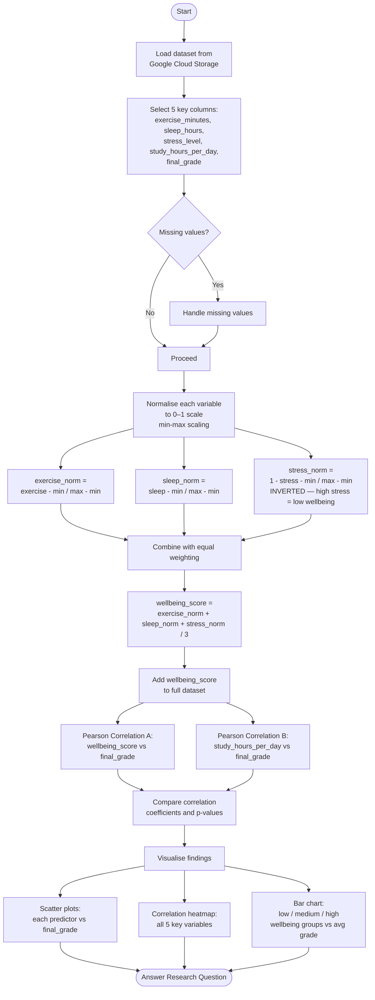

# Algorithm Flow Diagram 
# Its output is can be seen in student-wellbeing/algorithm-flow/Wellbeing Score Correlation-2026-06-03-195350.png

```mermaid
flowchart TD
    A([Start]) --> B[Load dataset from\nGoogle Cloud Storage]
    B --> C[Select 5 key columns:\nexercise_minutes, sleep_hours,\nstress_level, study_hours_per_day,\nfinal_grade]
    C --> D{Missing values?}
    D -- Yes --> E[Handle missing values]
    D -- No --> F[Proceed]
    E --> F

    F --> G[Normalise each variable\nto 0–1 scale\nmin-max scaling]

    G --> H[exercise_norm =\nexercise - min / max - min]
    G --> I[sleep_norm =\nsleep - min / max - min]
    G --> J[stress_norm =\n1 - stress - min / max - min\nINVERTED — high stress = low wellbeing]

    H --> K[Combine with equal weighting]
    I --> K
    J --> K

    K --> L[wellbeing_score =\nexercise_norm + sleep_norm + stress_norm / 3]

    L --> M[Add wellbeing_score\nto full dataset]

    M --> N[Pearson Correlation A:\nwellbeing_score vs final_grade]
    M --> O[Pearson Correlation B:\nstudy_hours_per_day vs final_grade]

    N --> P[Compare correlation\ncoefficients and p-values]
    O --> P

    P --> Q[Visualise findings]

    Q --> R[Scatter plots:\neach predictor vs final_grade]
    Q --> S[Correlation heatmap:\nall 5 key variables]
    Q --> T[Bar chart:\nlow / medium / high\nwellbeing groups vs avg grade]

    R --> U([Answer Research Question])
    S --> U
    T --> U
```
